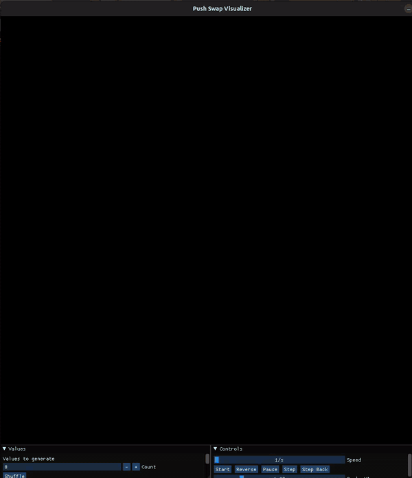

# Push Swap

A sorting algorithm project from 42 School that sorts a stack of integers using a limited set of operations, optimized for the minimum number of moves.

## Operations permitted

The following operations are available:

- `sa` -> **Swap A** - Swap the first 2 elements at the top of stack A;
- `sb` -> **Swap B** - Swap the first 2 elements at the top of stack B;
- `ss` -> **Swap both** - Execute `sa` and `sb` simultaneously;
- `pa` -> **Push A** - Take the first element from B and put it on top of A;
- `pb` -> **Push B** - Take the first element from A and put it on top of B;
- `ra` -> **Rotate A** - Shift all elements of stack A up by 1;
- `rb` -> **Rotate B** - Shift all elements of stack B up by 1;
- `rr` -> **Rotate both** - Execute `ra` and `rb` simultaneously;
- `rra` -> **Reverse Rotate A** - Shift all elements of stack A down by 1;
- `rrb` -> **Reverse Rotate B** - Shift all elements of stack B down by 1;
- `rrr` -> **Reverse Rotate both** - Execute `rra` and `rrb` simultaneously;

## Table of Contents

- [Algorithm](#algorithm)
- [Project Structure](#project-structure)
- [Installation](#installation)
- [Usage](#usage)
- [Testing](#testing)
- [Demo](#demo)

## Algorithm

The program uses different strategies based on the size of the input:

- **2-3 numbers**: Simple hardcoded optimal solutions
- **4-5 numbers**: Optimized manual sorting
- **Large sets (100+)**: **Radix Sort with binary indexing**
  - Numbers are indexed from smallest to largest
  - Sort by examining each bit position
  - Push numbers to stack B if the current bit is 0
  - Rotate back all numbers from B to A
  - Repeat for each bit position until sorted


## Project Structure

```
push_swap42/
├── assets/
│   ├── push_swap_cast.mp4      # Demo video of the visualizer
│   └── README.md               # Assets documentation
├── include/
│   ├── push_swap.h             # Main program header
│   └── checker.h               # Checker header
├── libft/                      # Custom C library
├── srcs/
│   ├── mandatory/
│   │   ├── check_args/
│   │   │   └── check_args.c          # Input validation
│   │   ├── instructions/
│   │   │   ├── push_case.c           # Push operations (pa, pb)
│   │   │   ├── swap_case.c           # Swap operations (sa, sb, ss)
│   │   │   ├── rotate_case.c         # Rotate operations (ra, rb, rr)
│   │   │   └── rrotate_case.c        # Reverse rotate (rra, rrb, rrr)
│   │   ├── sort/
│   │   │   ├── sort_min.c            # Sort algorithm for small sets
│   │   │   ├── sort_large.c          # Radix sort for large sets
│   │   │   └── sort_utils.c          # Sorting utilities
│   │   └── push_swap.c               # Main program
│   └── bonus/
│       ├── instructions/
│       │   ├── push_checker.c        # Push operations for checker
│       │   ├── swap_checker.c        # Swap operations for checker
│       │   ├── rotate_checker.c      # Rotate operations for checker
│       │   └── rrotate_checker.c     # Reverse rotate for checker
│       ├── checker.c                 # Checker main program
│       └── create_list.c             # Stack creation utilities
├── Makefile                    # Build configuration
└── README.md                   # This file
```


## Installation

### Prerequisites
- GCC or Clang compiler
- Make
- Libft

### Compile

```bash

# Compile push_swap
make

# Compile checker (bonus)
make bonus
```

This will create two executables:
- `push_swap` - The main sorting program
- `checker` - Validates if a sequence of operations correctly sorts the stack

## Usage

### Push Swap

```bash
./push_swap [numbers...]
```

**Examples:**

```bash
# Sort 5 random numbers
./push_swap 3 2 5 1 4
```
**Output:**
The program outputs the list of operations needed to sort the stack:
```
sa
pb
pb
ra
pa
pa
```

#### Error handling
The program outputs `Error` and exits for:
- Non-numeric arguments
- Integers outside the range of `int`
- Duplicate numbers
- Empty input

```bash
# These should all output "Error"
./push_swap 1 2 3 2        # Duplicate
./push_swap 1 abc 3        # Non-numeric
./push_swap 99999999999    # Out of range
```

### Checker

The **checker** program verifies if a sequence of operations correctly sorts a stack.

```bash
./push_swap [numbers...] | ./checker [numbers...]
```
**Output:**
The program outputs the list of operations needed to sort the stack:
```
Error - If invalid input is provided (pushswap error handler + not the same args)
OK - If the operations sort the stack correctly;
KO - If the operations don't sort the stack or are invalid;
```

**Example:**

```bash
# This should output "OK"
./push_swap 3 2 5 1 4 | ./checker 3 2 5 1 4
```

## Testing

### Quick Tests

```bash
# Test with 100 random numbers
ARG=$(shuf -i 1-1000 -n 100 | tr '\n' ' '); ./push_swap $ARG | wc -l

# Verify correctness with checker
ARG=$(shuf -i 1-1000 -n 100 | tr '\n' ' '); ./push_swap $ARG | ./checker $ARG
```


## Demo

Watch the push_swap algorithm in action, sorting 100 numbers with the visualizer:

<table>
	<tr>
		<td width="60%">
			
		<td width="40%">
		<b>What you're seeing in the demo:</b>
		<ul>
			<li>Stack A (left) starts with 100 unsorted numbers as colored bars</li>
			<li>The algorithm uses radix sort to efficiently sort by binary representation</li>
			<li>Stack B (right) temporarily holds numbers during sorting</li>
			<li>Final result: All 100 numbers perfectly sorted in ~860 operations!</li>
		</ul>
		</td>
  </tr>
</table>

**What you're seeing in the demo:**
- Stack A (left) starts with 100 unsorted numbers as colored bars
- The algorithm uses radix sort to efficiently sort by binary representation
- Stack B (right) temporarily holds numbers during sorting
- Final result: All 100 numbers perfectly sorted in ~860 operations!
